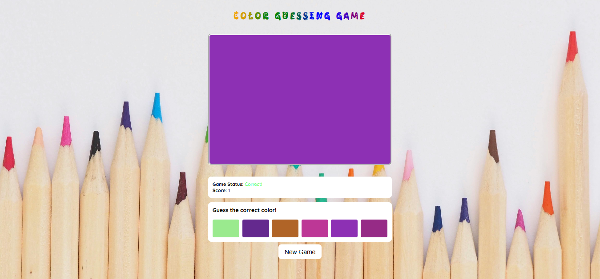

# Color Guessing Game

## Overview

The Color Guessing Game is an interactive web-based game where players attempt to guess a randomly selected color from six possible choices. The game provides immediate feedback on each guess, tracks the player's score, and includes a reset button to start a new round.

## Features

- Displays a target color for the player to guess.
- Provides six color options to choose from.
- Displays game instructions.
- Tracks and displays the player's score.
- Provides immediate feedback on whether the guess is correct or incorrect.
- Includes a "New Game" button to restart the game.
- Implements CSS animations for an engaging experience.
- Fully responsive design adaptable to different screen sizes.

## Technologies Used

- HTML
- CSS
- Vanilla JavaScript

## How to Play

1. The game displays a target color in a box.
2. Six color options appear below the target color.
3. Click on the color option that matches the target color.
4. If the guess is correct, the score increases, and a new target color is displayed.
5. If the guess is incorrect, feedback is provided, and the player can try again.
6. The "New Game" button resets the game.

## Implementation Details

- The game selects a random color from a predefined set of six colors.
- Each color option is assigned a background color corresponding to a possible guess.
- The player is provided immediate feedback on their selection.
- The game status updates dynamically.
- The score counter increments for each correct guess.
- The UI is styled with animations and color transitions.

## Project Structure

```text
|-- index.html
|-- style.css
|-- script.js
|-- assets/
    |-- color-bg.jpg
```

## How to Run the Game

1. Clone the repository.
2. Open `index.html` in a web browser.
3. Play the game!

---

### **Hosting**

The game can be hosted on any platform, such as:

[Live Game Link]()

---

### **Live Demo**

You can view a live demo of the game here: [Live Demo Link]()

---

### **Screenshot**



---

### **Required Attributes**

All required elements include `data-testid` attributes for testing purposes:

- `data-testid="colorBox"`: The target color display box.
- `data-testid="colorOption"`: Each color option button.
- `data-testid="gameInstructions"`: The game instructions text.
- `data-testid="gameStatus"`: Displays whether the guess is correct or incorrect.
- `data-testid="score"`: The player's current score.
- `data-testid="newGameButton"`: The button to start a new game.

---

### **Acknowledgments**

- [HNG Internship](https://hng.tech) for providing this task.
- Special thanks to mentors and peers for their support.

---
